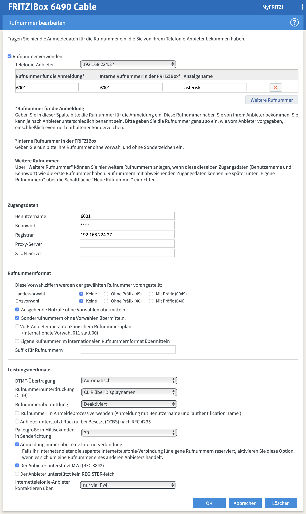

# Asterisk with Soft Modem for Bildschirmtext

This repository brings up a Debian Vagrant box with VirtualBox that has a fully configured Asterisk install in it. By connecting to this Asterisk from an analog telephone adapter (ATA) via SIP, you can hook up your historic Bildschirmtext terminal with built-in modem or a DBT-03 external modem, dial 01910, and convert the modem connection to an outgoing TCP connection to one of the retro BTX services.

The Asterisk config uses the [Asterisk Softmodem](https://github.com/proquar/asterisk-Softmodem) channel driver, which includes support for the V.23 (1200/75) modem standard and Bildschirmtext specific communication elements.

# Configuration

You might want to adjust the configuration to better suit your needs. All configuration is done through the single shell script [provision.sh](./provision.sh). The Asterisk config files are included as heredocs towards the end of the script. In particular, you might want to adjust the SIP account (username, password, extension number, in `pjsip.conf`) and the soft modem number and parameters (in `extensions.conf`).

# Bringing up the virtual machine

Run `vagrant up` to create the box and configure Asterisk. On a 2018 MacBook Pro with a decent internet connection, this takes about 5 minutes.

When Vagrant creates the virtual machine, a bridged network interface is configured. Depending on the configuration of the host system, Vagrant might ask for the host interface that should be used for the bridge. Make sure to pick the network that your SIP ATA is connected to, so it can reach the Asterisk server.

# Configuring your ATA

Simply configure the Asterisk server as a new SIP server, using the IP address of the VM, the extension `6001` as the username, and the password `unsecurepassword`.

Here's how that looks like in a Fritz!Box:

if you'd like to test the Asterisk config with a regular phone, you can dial `100` to hear the "Hello, world!" announcement.

# Further Reading

See [github.com/bildschirmtext](https://github.com/bildschirmtext/) for more software to make Bildschirmtext available again.
